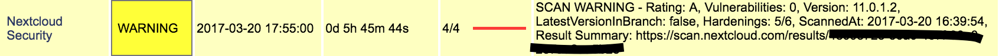

# check_nextcloud

[](http://badge.fury.io/js/check_nextcloud)
[](https://gemnasium.com/github.com/hobbyquaker/check_nextcloud)
[![License][mit-badge]][mit-url]

> Nagios/Icinga Nextcloud Security Check

Uses the API on [https://scan.nextcloud.com](scan.nextcloud.com) to check your Nextclouds Security with Nagios/Icinga. 
For further information see [https://nextcloud.com/blog/nextcloud-releases-security-scanner-to-help-protect-private-clouds/](https://nextcloud.com/blog/nextcloud-releases-security-scanner-to-help-protect-private-clouds/).
Mind that this API has a rate limit, so don't run this check too frequently.




## Installation

Prerequisites: [Node.js](https://nodejs.org)

`npm install -g check_nextcloud`


## Usage

Example: `check_nextcloud -u https://example.com/nextcloud`

```
check_nextcloud <options>

Options:
  -u, --nextcloud-url                  Nextcloud URL                  [required]
  -h, --hardening-warning              Number of missing Hardenings that
                                       generate Warning             [default: 2]
  -c, --hardening-critical             Number of missing Hardenings that
                                       generate Critical            [default: 4]
  -l, --disable-latestversion-warning  Don't generate Warning if not latest
                                       Version                         [boolean]
  -r, --requeue-minutes                Requeue Scan if older than given minutes
                                                                  [default: 180]
  --help                               Show help                       [boolean]
  --version                            Show version number             [boolean]
```

Nagios Command Definition Example:
``` 
define command {
        command_name    check_nextcloud
        command_line    /usr/local/bin/check_nextcloud -u $ARG1$
}
```

Nagios Service Definition Example:
``` 
define service {
        use                     generic-service
        host_name               example
        service_description     Nextcloud Security
        check_command           check_nextcloud!https://example.com/nextcloud
}
```


## Credits

Inspired by [https://github.com/janvonde/check_nextcloud](https://github.com/janvonde/check_nextcloud)


## License

MIT (c) Sebastian Raff

[mit-badge]: https://img.shields.io/badge/License-MIT-blue.svg?style=flat
[mit-url]: LICENSE
